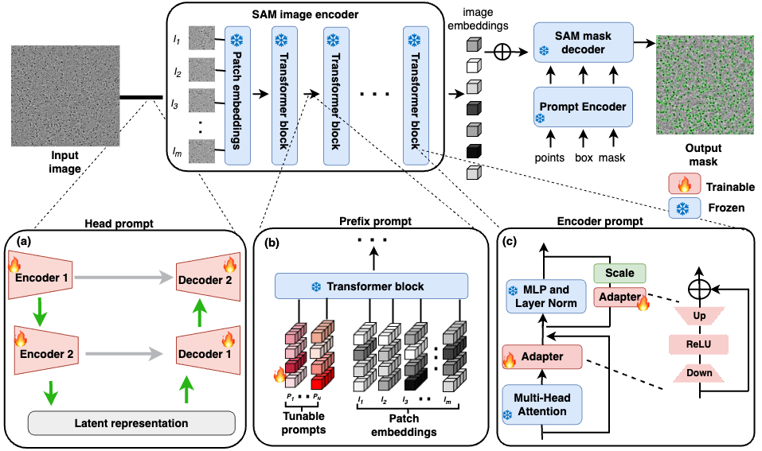

# Prompt_sam_cryoPPP

This is the official repository for Prompt_sam_cryoPPP : Adapting Segment Anything Model (SAM) through Prompt-based Learning for Enhanced Protein Identification in Cryo-EM Micrographs.

## A Quick Overview




## Requirement

Download **`model checkpoint`: [ViT-H SAM model.](https://dl.fbaipublicfiles.com/segment_anything/sam_vit_h_4b8939.pth)** and put it at ./model_checkpoint/

1. Create a virtual environment `conda create -n prompt_sam_cryoPPP python==3.8`
2. `git clone https://github.com/yangyang-69/Prompt_sam_cryoPPP.git`
3. Enter the Prompt_sam_cryoPPP folder `cd Prompt_sam_cryoPPP` and run `pip install -e .`

## Get Started

You can modify your default parameter settings in `./notebooks/SAM_conf/SAM_cfg.py` or refer to the parameter settings provided in [Reproduction of our papers](#Reproduction of our papers).

We provide code for training SAM in four different prompt ways as follows:

### Head-Prompt SAM

1. Train:  `python ./notebooks/train_head.py`
2. Evaluation: The code can automatically evaluate the model on the test set during training.
3. Test and Result Visualization: `python ./notebooks/test_head.py`.You can use the 'vis_image' function to visualize the segmentation results of the test dataset.

### Finetune SAM

1. Train:  `python ./notebooks/train_finetune.py`
2. Evaluation: The code can automatically evaluate the model on the test set during training.
3. Test and Result Visualization: `python ./notebooks/test_finetune.py`.You can use the 'vis_image' function to visualize the segmentation results of the test dataset.

### Prefix-Prompt SAM

1. Train:  `python ./notebooks/train_prefix.py`
2. Evaluation: The code can automatically evaluate the model on the test set during training.
3. Test and Result Visualization: `python ./notebooks/test_prefix.py`.You can use the 'vis_image' function to visualize the segmentation results of the test dataset.

### Encoder-Prompt SAM

1. Train:  `python ./notebooks/train_encoder.py`
2. Evaluation: The code can automatically evaluate the model on the test set during training.
3. Test and Result Visualization: `python ./notebooks/test_encoder.py`.You can use the 'vis_image' function to visualize the segmentation results of the test dataset.

## Reproduction of our papers
We provide a reproduction of some experiments, including data sets, parameter settings and checkpoints. You can download  the corresponding dataset and checkpoints at **[dataset and checkpoints](https:xxx)**, and modify your location in the parameter settings given below.

###  Evaluation of native SAM's efficacy
We use SAM’s automatic mask generator generated masks for a sample protein type (EMPIAR ID: 10028) and calculate the dice scores.


 **Figure 3**. Evaluation of native SAM's efficacy in protein identification using EMPIAR ID 10028 
cryo-EM micrographs.

Run `./notebooks/test_ori_sam.py`, get the mask and dice for testing the native SAM through the following command line.
```
python ./notebooks/test_ori_sam.py -net sam -exp_name test_original_on_10028 -sam_ckpt ./model_checkpoint/sam_vit_h_4b8939.pth -data_path ./dataset/10028_all
```

###  Adaptability introduced by three prompt-based learning approaches to SAM
To assess the adaptability introduced by the three proposed prompt-based learning approaches to SAM, we conducted preliminary tests on three distinct protein types with different training sizes from the CryoPPP dataset (EMPIAR IDs: 10028, 10947, and 10059).


**Figure 4**. Dice score comparisons of SAM with head prompt, prefix prompt, and encoder prompt on 
different training sizes using proteins from (a) EMPIAR ID 10028 (b) EMPIAR ID 10947 (c) EMPIAR
ID 10059 cryo-EM micrographs.

* **Train**:
1. Head prompt
```
xxx
```
2. Prefix prompt

```
python ./notebooks/train_prefix.py -net PromptVit -mod sam_token_prompt -exp_name train_prefix_all64_token_10028_5 -sam_ckpt ./model_checkpoint/sam_vit_h_4b8939.pth -b 1 -dataset CryoPPP -data_path ./dataset/10028_split/5 -NUM_TOKENS 64 -deep_token_block_configuration 1 1 1 1 1 1 1 1 1 1 1 1 1 1 1 1 1 1 1 1 1 1 1 1 1 1 1 1 1 1 1 1
```

3. Encoder prompt
```
xxx
```

* **Test**:
1. Head prompt
```
xxx
```
2. Prefix prompt

```
 python ./notebooks/test_prefix.py -net PromptVit -mod sam_token_prompt -exp_name test_prefix_all64_token_10028_5 -sam_ckpt ./model_checkpoint/sam_vit_h_4b8939.pth -weights ./model_checkpoint/prefix/10028_5.pth -b 1 -dataset CryoPPP -data_path ./dataset/10028_split -NUM_TOKENS 64 -deep_token_block_configuration 1 1 1 1 1 1 1 1 1 1 1 1 1 1 1 1 1 1 1 1 1 1 1 1 1 1 1 1 1 1 1 1
```

3. Encoder prompt
```
xxx
```


**Figure 5**. A sample visualization of head prompt outputs (a) input cryo-EM micrograph (b) 
prompted visualization after applying head prompt prior to SAM image encoder (c) segmentation mask from head prompted SAM (d) manual annotation to the input.

```
xxx
```

### Stability assessment


**Supplementary Figure 1** To assess the stability of our proposed prompt-based learning methods, we executed 10 separate evaluation tests on them, adhering to a uniform protocol. Subsequently, from the remaining data, we randomly selected 10 images for model training using head prompt, prefix prompt, and encoder prompt techniques. The trained models were then evaluated using the testing data. This procedure was reiterated for 10 rounds.

* dataset: xxx

### Ablation test for prefix prompt and encoder prompt
Our utilized ViT in SAM has 32 Transformer blocks. We conducted ablation tests ranging from inserting prompts into all Transformer blocks to including them in some topmost or bottommost Transformer blocks. 


**Supplementary Figure 2**. Comparative analysis of average Dice scores upon the integration of prefix prompts and encoder prompts at varied transformer layers within SAM.

You can set whether or not to add tokens to each ViT module through the **deep_token_block_configuration** parameter, and you can set the number of added tokens through the **NUM_TOKENS**.

## Acknowledgements

We would like to acknowledge the valuable contribution from OpenAI's GPT-3.5 model for aiding in language editing. This work was funded by the National Institutes of Health [R35-GM126985].

## Reference
