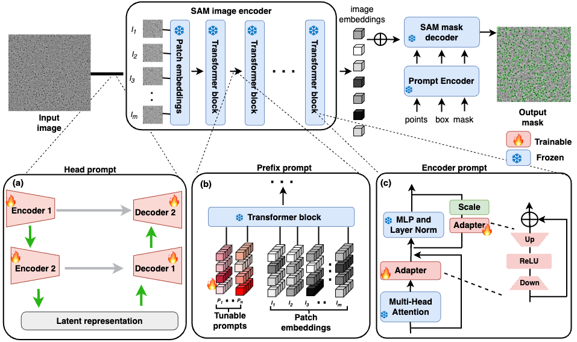

# Prompt_sam_cryoPPP

This is the official repository for Prompt_sam_cryoPPP : Adapting Segment Anything Model (SAM) through Prompt-based Learning for Enhanced Protein Identification in Cryo-EM Micrographs (submitted to [RECOMB 2024](https://recomb.org/recomb2024/)).

## A Quick Overview



## Requirement

Download **`model checkpoint`: [ViT-H SAM model.](https://dl.fbaipublicfiles.com/segment_anything/sam_vit_h_4b8939.pth)** and put it at ./model_checkpoint/

1. `git clone https://github.com/yangyang-69/Prompt_sam_cryoPPP.git`
2. Enter the Prompt_sam_cryoPPP folder `cd Prompt_sam_cryoPPP-main` and run `conda env create -f environment.yaml`
3. Activate the conda environment `conda activate sam`

## Get Started

###  Evaluation of native SAM's efficacy

We use SAM’s automatic mask generator generated masks for a sample protein type (EMPIAR ID: 10028) and calculate the dice scores. Run `./notebooks/test_ori_sam.py`, get the mask and dice for testing the native SAM through the following command line.

```
python ./notebooks/test_ori_sam.py -net sam -exp_name test_original_on_10028 -sam_ckpt ./model_checkpoint/sam_vit_h_4b8939.pth -data_path ./dataset/10028_all
```

- #### Command Line Arguments

  - -net ：net type [type: str]
  - -exp_name ：You can define your own name for this experiment [type: str]
  - -sam_ckpt : Storage path for SAM's chekpoint [type: str]
  - -data_path : Training  and Testing data storage path [type: str]

- #### Test Result Output Format

  ```
  Total score:xxx, IOU:xxx, DICE:xxx
  ```

  - Total score denotes the average loss of the test set
  - iou denotes the mean value of iou on the test set
  - dice denotes the mean value of dice on the test set

### Finetuning SAM


### Head-Prompt SAM

- #### Train 

  ```
  python ./notebooks/train_head.py -data_path ./dataset/10028_split/5 -data_name 10028 -exp_name few_shot_5 -save_path ./model_checkpoint/head
  ```

- #### Test and Result Visualization

  ```
  python ./notebooks/test_head.py -data_path ./dataset/10028_split -data_name 10028 -exp_name few_shot_5 -ckpt ./model_checkpoint/head/10028_5.pth
  ```

	You can use the 'vis_image' function to visualize the segmentation results of the test dataset.

- #### Command Line Arguments

  - -data_path ： Training  and Testing data storage path [type: str]
  - -data_name :  Name of the dataset involved in the training [type: str]
  - -exp_name :  You can define your own name for this experiment [type: str]
  - -save_path :  Training result storage path (e.g. checkpoint) [type: str]
  - -ckpt : The checkpoints you saved during training and their paths [type: str]

- #### Test Result Output Format

  ```
  Total score:xxx, IOU:xxx, DICE:xxx
  ```

  - Total score denotes the average loss of the test set
  - iou denotes the mean value of iou on the test set
  - dice denotes the mean value of dice on the test set

### Prefix-Prompt SAM

- #### Train

  ```
  python ./notebooks/train_prefix.py -net PromptVit -mod sam_token_prompt -exp_name train_prefix_all64_token_10028_5 -sam_ckpt ./model_checkpoint/sam_vit_h_4b8939.pth -b 1 -dataset CryoPPP -data_path ./dataset/10028_split/5 -NUM_TOKENS 64 -deep_token_block_configuration 1 1 1 1 1 1 1 1 1 1 1 1 1 1 1 1 1 1 1 1 1 1 1 1 1 1 1 1 1 1 1 1
  ```

- #### Test and Result Visualization: 

  ```
   python ./notebooks/test_prefix.py -net PromptVit -mod sam_token_prompt -exp_name test_prefix_all64_token_10028_5 -sam_ckpt ./model_checkpoint/sam_vit_h_4b8939.pth -weights ./model_checkpoint/prefix/10028_5.pth -b 1 -dataset CryoPPP -data_path ./dataset/10028_split -NUM_TOKENS 64 -deep_token_block_configuration 1 1 1 1 1 1 1 1 1 1 1 1 1 1 1 1 1 1 1 1 1 1 1 1 1 1 1 1 1 1 1 1
  ```

    You can use the 'vis_image' function to visualize the segmentation results of the test dataset.

- #### Command Line Arguments

  - -net ：net typ [type: str]
  - -mod ：mod type [type: str]
  - -exp_name ：You can define your own name for this experiment [type: str]
  - -sam_ckpt : Storage path for SAM's chekpoint [type: str]
  - -data_path : Training  and Testing data storage path [type: str]
  - -weights : the weights file you want to test [type: str]
  - -b : batch size [optional, type: int, default: 1]
  - -dataset : CryoPPP [optional, type: str,default:CryoPPP]
  - -NUM_TOKENS : The number of prefix-tokens added [optional, type: int, default: 64]
  - -deep_token_block_configuration : specify which block(31 block can use deep token, the first block use shallow token in default source code) add deep token :0: without deep token. 1: add deep token. [optional, type: list, default: [1,1,1,1, 1,1,1,1,1, 1,1,1,1,1, 1,1,1,1,1, 1,1,1,1,1, 1,1,1,1,1, 1,1]]

- #### Test Result Output Format

  ```
  Total score:xxx, IOU:xxx, DICE:xxx
  ```

  - Total score denotes the average loss of the test set
  - iou denotes the mean value of iou on the test set
  - dice denotes the mean value of dice on the test set

### Encoder-Prompt SAM

- #### Train

  ```
  python ./notebooks/train_encoder.py -net 'sam' -mod 'sam_adpt' -exp_name train_encoder_last_10028_5 -sam_ckpt ./model_checkpoint/sam_vit_h_4b8939.pth -b 1 -dataset CryoPPP -data_path ./dataset/10028_split/5 -image_encoder_configuration 3 3 3 3 3 3 3 3 3 3 3 3 3 3 3 3 3 3 3 3 3 3 3 3 3 3 3 3 3 3 3 3
  ```

- #### Test and Result Visualization: 

  ```
   python ./notebooks/test_encoder.py -net 'sam' -mod 'sam_adpt' -exp_name test_encoder_last_10028_5 -sam_ckpt ./model_checkpoint/sam_vit_h_4b8939.pth -weights ./model_checkpoint/encoder/10028_5.pth -b 1 -dataset CryoPPP -data_path ./dataset/10028_split/5 -image_encoder_configuration 3 3 3 3 3 3 3 3 3 3 3 3 3 3 3 3 3 3 3 3 3 3 3 3 3 3 3 3 3 3 3 3
  ```

    You can use the 'vis_image' function to visualize the segmentation results of the test dataset.

- #### Command Line Arguments

  - -net ：net typ [type: str]
  - -mod ：mod type [type: str]
  - -exp_name ：You can define your own name for this experiment [type: str]
  - -sam_ckpt : Storage path for SAM's checkpoint [type: str]
  - -data_path : Training  and Testing data storage path [type: str]
  - -weights : the weights file you want to test [type: str]
  - -b : batch size [optional, type: int, default: 1]
  - -dataset : CryoPPP [optional, type: str, default: CryoPPP]
  - -prompt_approach : the prompt approach: random_click, box or points_grids [optional, type: str, default:points_grids]
  - -image_encoder_configuration : image encoder configuration: 0: original sam. 1: space adapter. 2:MLP adapter. 3: space adapter + MLP adapter. [optional, type: list, default:[3,3,3,3, 3,3,3,3,3, 3,3,3,3,3, 3,3,3,3,3, 3,3,3,3,3, 3,3,3,3,3, 3,3]]

- #### Test Result Output Format

  ```
  Total score:xxx, IOU:xxx, DICE:xxx
  ```

  - Total score denotes the average loss of the test set
  - iou denotes the mean value of iou on the test set
  - dice denotes the mean value of dice on the test set

### Bulid With

- [opencv](https://opencv.org/) - The image processing library used

- [pytorch](https://pytorch.org/) - The deep learning backend used

## References
* Dhakal, Ashwin, et al. "A large expert-curated cryo-EM image dataset for machine learning protein particle picking." Scientific Data 10.1 (2023): 392.
* Wu, Junde, et al. "Medical sam adapter: Adapting segment anything model for medical image segmentation." arXiv preprint arXiv:2304.12620 (2023).
* Kirillov, Alexander, et al. "Segment anything." arXiv preprint arXiv:2304.02643 (2023).
* Jia, Menglin, et al. "Visual prompt tuning." European Conference on Computer Vision. Cham: Springer Nature Switzerland, 2022.

