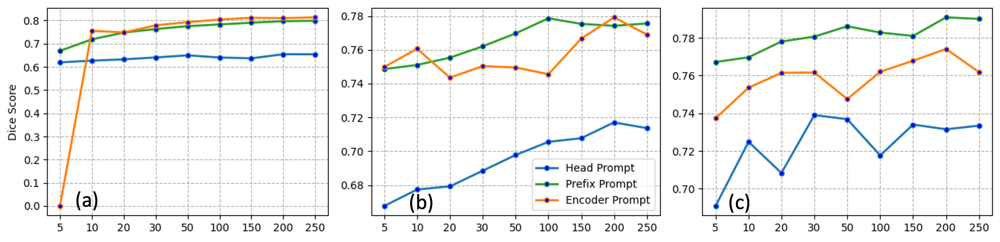

#  Adaptability introduced by three prompt-based learning approaches to SAM

To assess the adaptability introduced by the three proposed prompt-based learning approaches to SAM, we conducted preliminary tests on three distinct protein types with different training sizes from the CryoPPP dataset (EMPIAR IDs: 10028, 10947, and 10059).



**Figure 4**. Dice score comparisons of SAM with head prompt, prefix prompt, and encoder prompt on different training sizes using proteins from (a) EMPIAR ID 10028 (b) EMPIAR ID 10947 (c) EMPIAR ID 10059 cryo-EM micrographs.

## Guideline
For reproduction, please download the sample dataset and the corresponding checkpoints, and modify their paths in the given command line example.
By running the sample command line, you can get the **IOU and dice** of each test image and the **average of IOU and dice** of all images.
You can visualize the segmentation results of the test dataset through the **'vis_image'** function.

- **Command Line Arguments**
(放入参数解释)

- **Output presentation**
  ```
      => resuming from xxx.pth
      => loaded checkpoint xxx.pth (epoch x)
      [Your parameter settings]
      test data length: xx xx
      Validation round:   x%|      | 0/50   ['figure name']  iou: xxx  dice: xxx
      2023-11-08 10:48:56,154 - Total score: xxx, IOU: xxx, DICE: xxx || @ epoch x.
  ```

- **dataset:  10028, 10947, 10059**
  - Access 1 : Baidu Netdisk https:xxx
  - Access 2 : Google Drive  https:xxx
  
      ```
      📦10028
       ┣ 📂5
       ┃ ┣ 📂images
       ┃ ┃ ┗ 📜image1.png
       ┃ ┃ ┗ 📜image2.png
       ┃ ┃ ┗ ...
       ┃ ┣ 📂labels
       ┃ ┃ ┗ 📜image1.png
       ┃ ┃ ┗ 📜image2.png
       ┃ ┃ ┗ ...
       ┃ ...
       ┣ 📂250
       ┃ ┣ 📂images
       ┃ ┃ ┗ 📜image1.png
       ┃ ┃ ┗ 📜image2.png
       ┃ ┃ ┗ ...
       ┃ ┣ 📂labels
       ┃ ┃ ┗ 📜image1.png
       ┃ ┃ ┗ 📜image2.png
       ┃ ┃ ┗ ...
       ┣ 📂test
       ┃ ┣ 📂images
       ┃ ┃ ┗ 📜image1.png
       ┃ ┃ ┗ 📜image2.png
       ┃ ┃ ┗ ...
       ┃ ┣ 📂labels
       ┃ ┃ ┗ 📜image1.png
       ┃ ┃ ┗ 📜image2.png
       ┃ ┃ ┗ ...
      # 10028, 10947 and 10059 have the same structure
      ```

## Finetuning SAM

- checkpoint:
    - Access 1 : Baidu Netdisk https:xxx
    - Access 2 : Google Drive  https:xxx
   
    ```
    📦checkpoint
     ┣ 📂Figure4
     ┃ ┣ 📂finetune
     ┃ ┃ ┗ 📜finetune_10028_5.pth
     ┃ ┃ ┗ 📜finetune_10028_10.pth
     ┃ ┃ ┗ 📜finetune_10028_20.pth
     ┃ ┃ ┗ 📜finetune_10028_30.pth
     ┃ ┃ ┗ 📜finetune_10028_50.pth
     ┃ ┃ ┗ 📜finetune_10028_100.pth
     ┃ ┃ ┗ 📜finetune_10028_150.pth
     ┃ ┃ ┗ 📜finetune_10028_200.pth
     ┃ ┃ ┗ 📜finetune_10028_250.pth
    ```

- Command Line: 
   ```
    python ./notebooks/test_finetune.py -net sam -mod sam_fine -exp_name test_finetune_10028 -sam_ckpt ./model_checkpoint/sam_vit_h_4b8939.pth -weights ./checkpoint/Figure4/finetune/finetune_10028_5.pth -b 1 -dataset CryoPPP -data_path ./dataset/10028 -image_encoder_configuration 0 0 0 0 0 0 0 0 0 0 0 0 0 0 0 0 0 0 0 0 0 0 0 0 0 0 0 0 0 0 0 0
   ```

## Head-Prompt SAM

- checkpoint: 
   
    - Access 1 : Baidu Netdisk https://pan.baidu.com/s/1GjsKcyKQFqODxSqCfySYCA
    - Access 2 : Google Drive  https:xxx
   
    ```
    📦checkpoint
     ┣ 📂Figure4
     ┃ ┣ 📂head
     ┃ ┃ ┗ 📜head_prompt_10028_5.pth
     ┃ ┃ ┗ 📜head_prompt_10028_10.pth
     ┃ ┃ ┗ 📜head_prompt_10028_20.pth
     ┃ ┃ ┗ 📜head_prompt_10028_30.pth
     ┃ ┃ ┗ 📜head_prompt_10028_50.pth
     ┃ ┃ ┗ 📜head_prompt_10028_100.pth
     ┃ ┃ ┗ 📜head_prompt_10028_150.pth
     ┃ ┃ ┗ 📜head_prompt_10028_200.pth
     ┃ ┃ ┗ 📜head_prompt_10028_250.pth
    ```
   
- Command Line: （修改一下）
   ```
    python ./notebooks/test_head.py
   ```

## Prefix-Prompt SAM

- checkpoint:
    - Access 1 : Baidu Netdisk https://pan.baidu.com/s/1vbizYY8_XDQxMr5TjeJxjQ
    - Access 2 : Google Drive  https:xxx
   
    ```
    📦checkpoint
     ┣ 📂Figure4
     ┃ ┣ 📂prefix
     ┃ ┃ ┗ 📜prefix_10028_5.pth
     ┃ ┃ ┗ 📜prefix_10028_10.pth
     ┃ ┃ ┗ 📜prefix_10028_20.pth
     ┃ ┃ ┗ 📜prefix_10028_30.pth
     ┃ ┃ ┗ 📜prefix_10028_50.pth
     ┃ ┃ ┗ 📜prefix_10028_100.pth
     ┃ ┃ ┗ 📜prefix_10028_150.pth
     ┃ ┃ ┗ 📜prefix_10028_200.pth
     ┃ ┃ ┗ 📜prefix_10028_250.pth
    ```
- Command Line:
   ```
    python ./notebooks/test_prefix.py -net PromptVit -mod sam_token_prompt -exp_name test_prefix_all64_token_10028 -sam_ckpt ./model_checkpoint/sam_vit_h_4b8939.pth -weights ./checkpoint/Figure4/prefix/10028_5.pth -b 1 -dataset CryoPPP -data_path ./dataset/10028_split -NUM_TOKENS 64 -deep_token_block_configuration 1 1 1 1 1 1 1 1 1 1 1 1 1 1 1 1 1 1 1 1 1 1 1 1 1 1 1 1 1 1 1 1
   ```

## Encoder-Prompt SAM
- checkpoint:
    - Access 1 : Baidu Netdisk https:xxx
    - Access 2 : Google Drive  https:xxx
   
    ```
    📦checkpoint
     ┣ 📂Figure4
     ┃ ┣ 📂finetune
     ┃ ┃ ┗ 📜encoder_10028_5.pth
     ┃ ┃ ┗ 📜encoder_10028_10.pth
     ┃ ┃ ┗ 📜encoder_10028_20.pth
     ┃ ┃ ┗ 📜encoder_10028_30.pth
     ┃ ┃ ┗ 📜encoder_10028_50.pth
     ┃ ┃ ┗ 📜encoder_10028_100.pth
     ┃ ┃ ┗ 📜encoder_10028_150.pth
     ┃ ┃ ┗ 📜encoder_10028_200.pth
     ┃ ┃ ┗ 📜encoder_10028_250.pth
    ```

- Command Line: 
   ```
    python ./notebooks/test_encoder.py -net sam -mod sam_adpt -exp_name test_finetune_10028 -sam_ckpt ./model_checkpoint/sam_vit_h_4b8939.pth -weights ./checkpoint/Figure4/encoder/encoder_10028_5.pth -b 1 -dataset CryoPPP -data_path ./dataset/10028 -image_encoder_configuration 3 3 3 3 3 3 3 3 3 3 3 3 3 3 3 3 3 3 3 3 3 3 3 3 3 3 3 3 3 3 3 3 
   ```