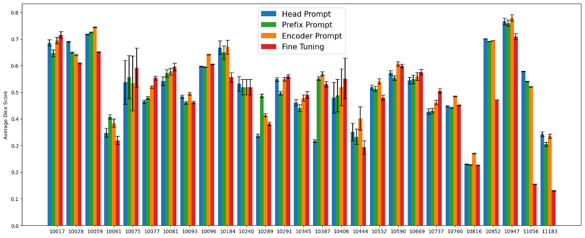

#  Comparison of finetuning and prompting approaches across all protein types 

For each protein type sourced from CryoPPP dataset we randomly selected 10 samples as the training set, with the remaining samples designated as the test set for SAM adaptation. Figure 6 showcases the average Dice scores, accompanied by error bars, derived from both the fine-tuning and the three prompt-based learning techniques. 



**Figure 6** Average Dice scores of SAM with head prompt, prefix prompt, encoder prompt, and fine-tuning across all protein types

## Guideline
For reproduction, please download the sample dataset and the corresponding checkpoints, and modify their paths in the given command line example.
By running the sample command line, you can get the **IOU and dice** of each test image and the **average of IOU and dice** of all images.

```
Total score: xxx, IOU: xxx, DICE: xxx
```

You can visualize the segmentation results of the test dataset through the **'vis_image'** function

### Dataset:  10028

- Baidu Netdisk : https://pan.baidu.com/s/1zy1dMKHwNPk8MXjBgFlicA (lv57)

- Google Drive : https:xxx

  ```
  📦dataset
   ┣ 📂10028
   ┃ ┣ 📂train
   ┃ ┃ ┣ 📂images
   ┃ ┃ ┃ ┗ 📜image1.png
   ┃ ┃ ┃ ┗ 📜image2.png
   ┃ ┃ ┣ 📂labels
   ┃ ┃ ┃ ┗ 📜image1.png
   ┃ ┃ ┃ ┗ 📜image2.png
   ┃ ┣ 📂valid
   ┃ ┃ ┣ 📂images
   ┃ ┃ ┃ ┗ 📜image1.png
   ┃ ┃ ┃ ┗ 📜image2.png
   ┃ ┃ ┣ 📂labels
   ┃ ┃ ┃ ┗ 📜image1.png
   ┃ ┃ ┃ ┗ 📜image2.png
   ┃ ┣ 📂test
   ┃ ┃ ┣ 📂images
   ┃ ┃ ┃ ┗ 📜image1.png
   ┃ ┃ ┃ ┗ 📜image2.png
   ┃ ┃ ┣ 📂labels
   ┃ ┃ ┃ ┗ 📜image1.png
   ┃ ┃ ┃ ┗ 📜image2.png
   ┣ 📂10059
   ┃ ...
   ┣ 📂10947
   ┗ ...
  # Every protein type have the same structure.
  ```

### Finetuning SAM

- #### checkpoint
  
    - Baidu Netdisk https:xxx
   - Google Drive  https:xxx
     
       ```
       📦checkpoint
        ┣ 📂Figure6
        ┃ ┣ 📂head
        ┃ ┃ ┗ 📜finetune_10028_5.pth
        ┃ ┃ ┗ 📜finetune_10059_5.pth
        ┃ ┃ ┗ 📜finetune_10947_5.pth
       ```
   
- #### Command Line
  
   ```
    python ./notebooks/test_finetune.py -net sam -mod sam_fine -exp_name test_finetune_10028 -sam_ckpt ./model_checkpoint/sam_vit_h_4b8939.pth -weights ./checkpoint/FIgure6/finetune/finetune_10028.pth -b 1 -dataset CryoPPP -data_path ./dataset/1024/10028 -image_encoder_configuration 0 0 0 0 0 0 0 0 0 0 0 0 0 0 0 0 0 0 0 0 0 0 0 0 0 0 0 0 0 0 0 0
   ```


### Head-Prompt SAM

- #### checkpoint
  
    - Baidu Netdisk https://pan.baidu.com/s/1FeGriwB9GkgKqgzA9_EJNQ (njcz)
    - Google Drive  https:xxx

    ```
    📦checkpoint
     ┣ 📂Figure6
     ┃ ┣ 📂head
     ┃ ┃ ┗ 📜head_prompt_10028_5.pth
     ┃ ┃ ┗ 📜head_prompt_10059_5.pth
     ┃ ┃ ┗ 📜head_prompt_10947_5.pth
    ```
    
- #### Command Line
  
   ```
   python ./notebooks/test_head.py -data_path ./dataset/1024/10028 -data_name 10028 -exp_name test_head_10028 -ckpt ./checkpoint/Fgiure6/head/head_prompt_10028_5.pth
   ```

- #### Command Line Arguments

  - -data_path ： Training and Testing data storage path [type: str]
  - -data_name : Name of the dataset involved in the training [type: str]
  - -exp_name : You can define your own name for this experiment [type: str]
  - -ckpt : The checkpoints you saved during training and their paths [type: str]

### Prefix-Prompt SAM

- #### checkpoint
  
    - Baidu Netdisk : https://pan.baidu.com/s/1kL62juXbRveVNhC-uvIejQ (zq92)
    - Google Drive : https:xxx
         ```
         📦checkpoint
          ┣ 📂Figure6
          ┃ ┣ 📂prefix
          ┃ ┃ ┗ 📜prefix_10028_5.pth
          ┃ ┃ ┗ 📜prefix_10059_5.pth
          ┃ ┃ ┗ 📜prefix_10947_5.pth
         ```

- #### Command Line
  
   ```
    python ./notebooks/test_prefix.py -net PromptVit -mod sam_token_prompt -exp_name test_prefix_all64_token_10028 -sam_ckpt ./model_checkpoint/sam_vit_h_4b8939.pth -weights ./checkpoint/FIgure6/prefix_10028_5.pth -b 1 -dataset CryoPPP -data_path ./dataset/1024/10028 -NUM_TOKENS 64 -deep_token_block_configuration 1 1 1 1 1 1 1 1 1 1 1 1 1 1 1 1 1 1 1 1 1 1 1 1 1 1 1 1 1 1 1 1
   ```

- #### Command Line Arguments

  - -net ：net type [type: str]
  - -mod ：mod type [type: str]
  - -exp_name ：You can define your own name for this experiment [type: str]
  - -sam_ckpt : Storage path for SAM's chekpoint [type: str]
  - -b : batch size [type: int]
  - -dataset : CryoPPP [type: str]
  - -data_path : Training and Testing data storage path [type: str]
  - -NUM_TOKENS : The number of prefix-tokens added [type: int]
  - -deep_token_block_configuration : specify which block(31 block can use deep token, the first block use shallow token in default source code) add deep token :0: without deep token. 1: add deep token. [type: list]
  - -weights : the weights file you want to test [type: str]

### Encoder-Prompt SAM

- #### checkpoint
  
    - Baidu Netdisk https:xxx
   - Google Drive  https:xxx
     
       ```
       📦checkpoint
        ┣ 📂Figure6
        ┃ ┣ 📂head
        ┃ ┃ ┗ 📜encoder_10028_5.pth
        ┃ ┃ ┗ 📜encoder_10059_5.pth
        ┃ ┃ ┗ 📜encoder_10947_5.pth
       ```
   
- #### Command Line
  
   ```
    python ./notebooks/test_encoder.py -net sam -mod sam_adpt -exp_name test_encoder_10028 -sam_ckpt ./model_checkpoint/sam_vit_h_4b8939.pth -weights ./checkpoint/FIgure6/encoder/encoder_10028.pth -b 1 -dataset CryoPPP -data_path ./dataset/1024/10028 -image_encoder_configuration 3 3 3 3 3 3 3 3 3 3 3 3 3 3 3 3 3 3 3 3 3 3 3 3 3 3 3 3 3 3 3 3 