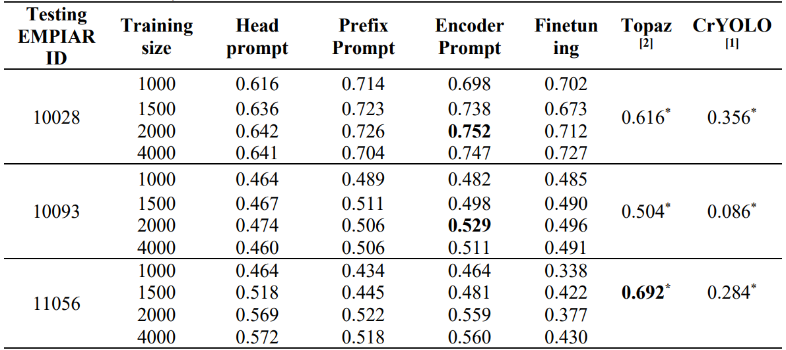

#  Comparisons with existing tools

we compared our techniques with two accessible cryo-EM protein identification tools: crYOLO and 
Topaz.


**Figure 7**. Figure 7. Visualization of protein particle identification on three sample micrographs achieved by SAM with (a) Head Prompt, (b) Prefix Prompt, (c) Encoder Prompt, (d) Finetuning, along with (e) CrYOLO, and (f) Topaz.



## Guideline
For reproduction, please download the sample dataset and the corresponding checkpoints, and modify their paths in the given command line example.
By running the sample command line, you can get the **IOU and dice** of each test image and the **average of IOU and dice** of all images.

```
Total score: xxx, IOU: xxx, DICE
```

You can visualize the segmentation results of the test dataset through the **'vis_image'** function.


- ### **Dataset:  large**

  - Baidu Netdisk ：https://pan.baidu.com/s/1uu14w11I2HlW_ZHIzuqLCw （jm1j）
  - Google Drive  https:xxx
    ```
    📦large
     ┣ 📂train
     ┃ ┣ 📂images
     ┃ ┃ ┗ 📜image1.png
     ┃ ┃ ┗ 📜...
     ┃ ┣ 📂labels
     ┃ ┃ ┗ 📜image1.png
     ┃ ┃ ┗ 📜...
     ┣ 📂valid
     ┃ ┣ 📂images
     ┃ ┃ ┗ 📜image1.png
     ┃ ┃ ┗ 📜...
     ┃ ┣ 📂labels
     ┃ ┃ ┗ 📜image1.png
     ┃ ┃ ┗ 📜...
     ┣ 📂test_7types
     ┃ ┣ 📂10017
     ┃ ┃ ┣ 📂images
     ┃ ┃ ┃ ┗ 📜image1.png
     ┃ ┃ ┃ ┗ ...
     ┃ ┃ ┣ 📂labels
     ┃ ┃ ┃ ┗ 📜image1.png
     ┃ ┃ ┃ ┗ ...
     ┃ ┣ 📂...
    ```

### Finetuning SAM
- #### checkpoint
  
    - Baidu Netdisk  https://pan.baidu.com/s/1X4U3Vg9d-O8MBwv1cWySLw  （gqcy）
   - OneDrive
     
   
    ```
    📦checkpoint
     ┣ 📂Figure7
     ┃ ┗ 📜finetune_large_train_80.pth
    ```
   
- #### Command Line
  
   ```
   python ./notebooks/test_finetuning.py -net sam_fineTuning -mod sam_fine -exp_name test_fine_large -sam_ckpt ./model_checkpoint/sam_vit_h_4b8939.pth -weights ./checkpoint/finetune/finetune_large_train_80.pth -b 1 -dataset CryoPPP -data_path ./dataset/10028_split/5 -fine_tuning_configuration 0 0 0 0 0 0 0 0 0 0 0 0 0 0 0 0 0 0 0 0 0 0 0 0 0 0 0 0 0 0 0 0
   ```

- #### Command Line Arguments

  - -net: net type [type: str]
  - -mod: mod type [type: str]
  - -exp_name: You can define your own name for this experiment [type: str]
  - -sam_ckpt: Storage path for SAM's checkpoint [type: str]
  - -data_path: Training and Testing data storage path [type: str]
  - -weights: The weights file you want to test [type: str]
  - -b: Batch size [optional, type: int, default: 1]
  - -dataset: CryoPPP [optional, type: str, default: CryoPPP]
  - -fine_tuning_configuration: Specify which blocks need to be frozen 1: doesn't freeze the block, 0: freeze the block [optional, type: list, default:[0,0,0,0, 0,0,0,0,0, 0,0,0,0,0, 0,0,0,0,0, 0,0,0,0,0, 0,0,0,0,0, 0,0]]

### Head-Prompt SAM

- #### checkpoint
  
    - Baidu Netdisk：https://pan.baidu.com/s/1X4U3Vg9d-O8MBwv1cWySLw  （gqcy）
    - OneDrive  
      
    ```
    📦checkpoint
     ┣ 📂Figure7
     ┃ ┗ 📜head_prompt_large_train_80.pth
    ```
  
- #### Command Line
  
   ```
   python ./notebooks/test_head.py -data_path ./dataset/large -data_name 10028 -exp_name test_head_large -ckpt ./checkpoint/Fgiure7/head/head_prompt_large_train_80.pth
   ```

- #### Command Line Arguments

  - -data_path ： Training and Testing data storage path [type: str]
  - -data_name : Name of the dataset involved in the training [type: str]
  - -exp_name : You can define your own name for this experiment [type: str]
  - -ckpt : The checkpoints you saved during training and their paths [type: str]

### Prefix-Prompt SAM

- #### checkpoint
  
    - Baidu Netdisk ：https://pan.baidu.com/s/1X4U3Vg9d-O8MBwv1cWySLw  （gqcy）
    - OneDrive
      
    
    ```
    📦checkpoint
    ┣ 📂Figure7
    ┃ ┗ 📜prefix_large_train_80.pth
    ```
    
- #### Command Line
  
   ```
   python ./notebooks/test_prefix.py -net PromptVit -mod sam_token_prompt -exp_name test_prefix_all64_token_large -sam_ckpt ./model_checkpoint/sam_vit_h_4b8939.pth -weights ./checkpoint/Figure7/prefix_large_train_80.pth -b 1 -dataset CryoPPP -data_path ./dataset/large/test_7types -NUM_TOKENS 64 -deep_token_block_configuration 1 1 1 1 1 1 1 1 1 1 1 1 1 1 1 1 1 1 1 1 1 1 1 1 1 1 1 1 1 1 1 1
   ```

- #### Command Line Arguments

  - -net ：net typ [type: str]
  - -mod ：mod type [type: str]
  - -exp_name ：You can define your own name for this experiment [type: str]
  - -sam_ckpt : Storage path for SAM's chekpoint [type: str]
  - -data_path : Training  and Testing data storage path [type: str]
  - -weights : the weights file you want to test [type: str]
  - -b : batch size [optional, type: int, default: 1]
  - -dataset : CryoPPP [optional, type: str,default:CryoPPP]
  - -NUM_TOKENS : The number of prefix-tokens added [optional, type: int, default: 64]
  - -deep_token_block_configuration : specify which block(31 block can use deep token, the first block use shallow token in default source code) add deep token :0: without deep token. 1: add deep token. [optional, type: list, default: [1,1,1,1, 1,1,1,1,1, 1,1,1,1,1, 1,1,1,1,1, 1,1,1,1,1, 1,1,1,1,1, 1,1]]

### Encoder-Prompt SAM

- #### checkpoint
  
    - Baidu Netdisk :  https://pan.baidu.com/s/1X4U3Vg9d-O8MBwv1cWySLw  （gqcy）
   - OneDrive
     
   
    ```
    📦checkpoint
     ┣ 📂Figure7
     ┃ ┗ 📜encoder_large_train_80.pth
    ```
   
- #### Command Line
  
   ```
    python ./notebooks/test_encoder.py -net 'sam' -mod 'sam_adpt' -exp_name test_encoder_large -sam_ckpt ./model_checkpoint/sam_vit_h_4b8939.pth -weights ./checkpoint/Figure7/encoder_large_train_80.pth -b 1 -dataset CryoPPP -data_path ./dataset/large/5 -image_encoder_configuration 3 3 3 3 3 3 3 3 3 3 3 3 3 3 3 3 3 3 3 3 3 3 3 3 3 3 3 3 3 3 3 3
   ```

- #### Command Line Arguments

  - -net: net type [type: str]
  - -mod: mod type [type: str]
  - -exp_name: You can define your own name for this experiment [type: str]
  - -sam_ckpt: Storage path for SAM's checkpoint [type: str]
  - -data_path: Training and Testing data storage path [type: str]
  - -weights: The weights file you want to test [type: str]
  - -b: Batch size [optional, type: int, default: 1]
  - -dataset: CryoPPP [optional, type: str, default: CryoPPP]
  - -image_encoder_configuration: Image encoder configuration: 0: original sam. 1: space adapter. 2:MLP adapter. 3: space adapter + MLP adapter. [optional, type: list, default:[3,3,3,3, 3,3,3,3,3, 3,3,3,3,3, 3,3,3,3,3, 3,3,3,3,3, 3,3,3,3,3, 3,3]]